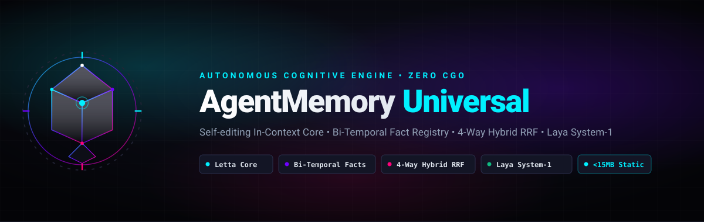

# 🧠 AgentMemory Universal (`agent-memory`)

<p align="center">
  
</p>

<p align="center">
  <a href="https://pkg.go.dev/github.com/surtr85/agent-memory"></a>
  <a href="https://opensource.org/licenses/MIT"></a>
  <a href="https://golang.org"></a>
  <a href="https://github.com/surtr85/agent-memory/releases"></a>
</p>

**AgentMemory Universal** is an ultra-fast, production-grade, local-first cognitive memory engine written in **Pure Go (`CGO_ENABLED=0`)**. It compiles into a single, dependency-free static binary (<15 MB) delivering sub-millisecond query latency and zero external runtime dependencies.

It synthesizes the world's most acclaimed agent memory paradigms into one unified, rock-solid cognitive architecture:
* 🧩 **Letta (MemGPT)**: Self-editing, in-context **Working Core Memory Blocks** (`human`, `persona`, `environment`) that bootstrap instantly into agent system prompts (<400 tokens) with zero retrieval latency.
* ⚡ **Mem0**: **Atomic Fact Extraction & Entity Linking**, decoupling memory from sprawling document blobs into discrete assertions scoped by domain namespaces.
* ⏳ **Graphiti (Zep)**: **Bi-Temporal Knowledge Modeling** (`valid_from`, `valid_until`, `recorded_at`, `invalidated_at`). Contradictions close and invalidate older facts gracefully without destructive data loss.
* ⚙️ **Cognee**: **ECL (Extract, Cognify, Load) Pipeline** with entity-relationship extraction and markdown structure awareness.
* 🎯 **Hindsight**: **4-Way Hybrid Retrieval Fusion** (Dense Vector + BM25 with multilingual Persian/Arabic normalizer + Entity Graph Traversal + Temporal Slicing) with Reciprocal Rank Fusion (RRF).
* ⚡ **Laya (Jev AI / TypeSafe System-1)**: Non-autoregressive System-1 decision engine integration running sub-15ms typed evaluations on AMD Radeon 780M Vulkan for automatic namespace routing, query classification, and observation triage.

---

## 🏛️ Architecture Overview

```
┌────────────────────────────────────────────────────────────────────────────────────────┐
│                   AGENT MEMORY UNIVERSAL (v3.0) PURE-GO ARCHITECTURE                   │
└────────────────────────────────────────────────────────────────────────────────────────┘

  ┌────────────────────────────────────────────────────────────────────────────────────┐
  │ 1. IN-CONTEXT CORE MEMORY (Working Context Injection — < 400 Tokens)                │
  │    • persona: Tone, communication style, peer demeanor (no corporate slop)         │
  │    • human: User identity, preferences, hard constraints                           │
  │    • environment: Active machine, OS, window manager, current working targets      │
  │    • Tools: memory_replace_block, memory_append_block, memory_set_block            │
  └────────────────────────────────────────────────────────────────────────────────────┘
                                        │
                                        ▼
  ┌────────────────────────────────────────────────────────────────────────────────────┐
  │ 2. SCOPED DOMAIN NAMESPACES                                                        │
  │    ┌──────────────┐   ┌──────────────┐   ┌──────────────┐   ┌─────────────────┐    │
  │    │    System    │   │  Trading/FX  │   │  E-Commerce  │   │   Literature    │    │
  │    │   & Coding   │   │  & Quants    │   │ (Rose Shop)  │   │   Translation   │    │
  │    └──────────────┘   └──────────────┘   └──────────────┘   └─────────────────┘    │
  └────────────────────────────────────────────────────────────────────────────────────┘
                                        │
                                        ▼
  ┌────────────────────────────────────────────────────────────────────────────────────┐
  │ 3. BI-TEMPORAL ATOMIC FACT REGISTRY (Pure Go SQLite ACID Storage)                  │
  │    • Triples: (Subject) --[Predicate]--> (Object)                                  │
  │    • Valid Time: valid_from, valid_until (real-world truth horizon)                │
  │    • System Time: recorded_at, invalidated_at (transaction audit trail)             │
  │    • Contradiction Auto-Resolver (Supersede rather than destroy)                   │
  └────────────────────────────────────────────────────────────────────────────────────┘
                                        │
                                        ▼
  ┌────────────────────────────────────────────────────────────────────────────────────┐
  │ 4. 4-WAY HYBRID RETRIEVAL ENGINE (Hindsight SOTA Architecture)                     │
  │    ┌─────────────────┬──────────────────┬─────────────────┬───────────────────┐    │
  │    │  Dense Vectors  │   Lexical BM25   │ Entity/Relation │ Temporal Slicing  │    │
  │    │ (BGE-M3/Ollama) │ (Persian Normal) │ (Multi-hop BFS) │ (Active vs Hist.) │    │
  │    └─────────────────┴──────────────────┴─────────────────┴───────────────────┘    │
  │                                     │                                              │
  │                                     ▼                                              │
  │               Reciprocal Rank Fusion (RRF) & Confidence Scorer                     │
  └────────────────────────────────────────────────────────────────────────────────────┘
                                        │
                                        ▼
  ┌────────────────────────────────────────────────────────────────────────────────────┐
  │ 5. UNIVERSAL INTERFACES & RUNTIMES                                                 │
  │    • FastMCP 2.0 Server: stdio & SSE for Pi, Claude Code, Cursor, Antigravity       │
  │    • High-Performance CLI: `agent-memory add`, `query`, `core`, `inspect`, `serve` │
  │    • Single Static Binary (<15MB, CGO_ENABLED=0)                                   │
  │    • Standalone Packaging: Docker / Docker Compose / Nix Flake (buildGoModule)     │
  └────────────────────────────────────────────────────────────────────────────────────┘
```

---

## 🚀 Quick Start & Installation

### Option 1: Go Install (Recommended)
```bash
go install github.com/surtr85/agent-memory/cmd/agent-memory@latest
```

### Option 2: Build From Source (Zero CGO)
```bash
git clone https://github.com/surtr85/agent-memory.git
cd agent-memory
make build
./bin/agent-memory health
```

### Option 3: Nix Flake
```bash
# Run directly without installation
nix run github.com/surtr85/agent-memory -- health

# Or enter dev shell with all tools
nix develop github.com/surtr85/agent-memory
```

### Option 4: Docker
```bash
docker run -d \
  -v ~/.local/share/agent-memory:/data \
  -e AGENT_MEMORY_DB=/data/memory.db \
  --name agent-memory \
  ghcr.io/surtr85/agent-memory:latest
```

---

## 🛠️ Model Context Protocol (MCP) Integration

`agent-memory` exposes a full **FastMCP 2.0** server over `stdio` and `sse` implementing 15 cognitive tools.

### Claude Desktop (`claude_desktop_config.json`)
```json
{
  "mcpServers": {
    "agent-memory": {
      "command": "agent-memory",
      "args": ["serve"]
    }
  }
}
```

### Cursor (`.cursor/mcp.json`)
```json
{
  "mcpServers": {
    "agent-memory": {
      "command": "agent-memory",
      "args": ["serve"]
    }
  }
}
```

### Pi Coding Agent (`~/.pi/agent/mcp.json`)
```json
{
  "mcpServers": {
    "agent-memory": {
      "command": "agent-memory",
      "args": ["serve"]
    }
  }
}
```

---

## 🧰 MCP Tool Suite (15 Cognitive Tools)

| Tool Name | Parameters | Purpose |
| :--- | :--- | :--- |
| `memory_get_bootstrap` | None | Returns compact XML markdown (<400 tokens) of working core memory for instant prompt injection |
| `memory_get_block` | `label` | Retrieve content of a Letta core block (`human`, `persona`, `environment`) |
| `memory_set_block` | `label`, `content` | Set or update a core memory block |
| `memory_replace_block` | `label`, `old_content`, `new_content` | Precision in-context replacement without hallucinating context loss |
| `memory_append_block` | `label`, `content` | Append facts or context to a core memory block |
| `memory_list_blocks` | None | List all registered core blocks and their token metrics |
| `memory_add_fact` | `namespace`, `subject`, `predicate`, `object`, `source` | Record atomic triple with automatic contradiction resolution |
| `memory_get_active_facts` | `namespace` | Retrieve all currently valid facts for a domain |
| `memory_get_facts_at` | `namespace`, `timestamp` | Time-travel query: inspect knowledge state at any ISO8601 point in history |
| `memory_search` | `query`, `namespace`, `top_k`, `include_historical` | 4-way hybrid search (Dense Vector + BM25 + Graph BFS + Temporal) via RRF |
| `memory_ingest_markdown` | `namespace`, `title`, `content` | ECL pipeline: chunks note by headings, embeds, extracts `[[Wikilinks]]` |
| `memory_record_observation` | `category`, `content`, `namespace` | Log real-time observations (`PREFERENCE`, `DISCOVERY`, `TOOL_ERROR`) |
| `memory_consolidate_observations` | `namespace` | Distill pending stream observations into active facts or core blocks |
| `memory_health_check` | None | Run SQLite WAL health check, verify vector dimensions and table indices |
| `memory_stats` | None | Detailed breakdown of facts, chunks, and entities by namespace |
| `memory_decision` | `state`, `preset` | Run sub-15ms Laya / Jev AI System-1 typed decision over state |

---

## 💻 CLI Commands & Examples

### 1. In-Context Working Memory Bootstrapping
```bash
$ agent-memory bootstrap
### Core Memory Context
<environment>
NixOS Linux (x86_64), Niri Wayland scrollable compositor, Alacritty terminal.
</environment>
<human>
User is Sajjad: Systems architect, full-stack engineer, algorithmic trader. Values directness and clean code.
</human>
<persona>
I am Amadeus, an autonomous, precise AI systems architect. Zero fluff, elite peer demeanor.
</persona>
```

### 2. Bi-Temporal Fact Recording & Contradiction Resolution
```bash
# Add initial fact
$ agent-memory fact add system DesktopEnvironment uses_compositor Hyprland "August 2026 setup"
Fact recorded successfully [ID: 8a4b...]

# Later, update compositor: older fact is superseded automatically, not destroyed!
$ agent-memory fact add system DesktopEnvironment uses_compositor Niri "Migrated to Niri"
Fact recorded successfully [ID: c12f...]

# Inspect active truth
$ agent-memory fact list --ns system
Active Facts (1):
  • [system] (DesktopEnvironment) --[uses_compositor]--> (Niri) [source: Migrated to Niri]
```

### 3. 4-Way Hybrid Search
```bash
$ agent-memory search "DesktopEnvironment compositor" --ns system
Search Results (1 matches for "DesktopEnvironment compositor"):

[1] Type: fact | NS: system | Score: 0.0164
    Content: DesktopEnvironment uses_compositor Niri
```

### 4. Health & Statistics
```bash
$ agent-memory health
Status:        HEALTHY
Engine:        modernc.org/sqlite (Pure Go, Zero CGO, WAL mode)
Database Path: /home/amadeus/.local/share/agent-memory/memory.db
Core Blocks:   3
Atomic Facts:  2
Chunks:        14
Entities:      8
Observations:  0
```

---

## 🧪 Testing & Verification

The test suite runs with 100% pure Go without any external services or CGO:

```bash
make test
# or
go test -count=1 -v ./...
```

Output:
```text
ok  	github.com/surtr85/agent-memory/internal/blocks      0.008s
ok  	github.com/surtr85/agent-memory/internal/config      0.002s
ok  	github.com/surtr85/agent-memory/internal/db          0.006s
ok  	github.com/surtr85/agent-memory/internal/embedding   0.005s
ok  	github.com/surtr85/agent-memory/internal/normalizer  0.002s
ok  	github.com/surtr85/agent-memory/internal/pipeline    0.009s
ok  	github.com/surtr85/agent-memory/internal/retrieval   0.008s
ok  	github.com/surtr85/agent-memory/internal/server      0.012s
ok  	github.com/surtr85/agent-memory/internal/temporal    0.039s
```

---

## 📄 License

Licensed under the [MIT License](LICENSE).
